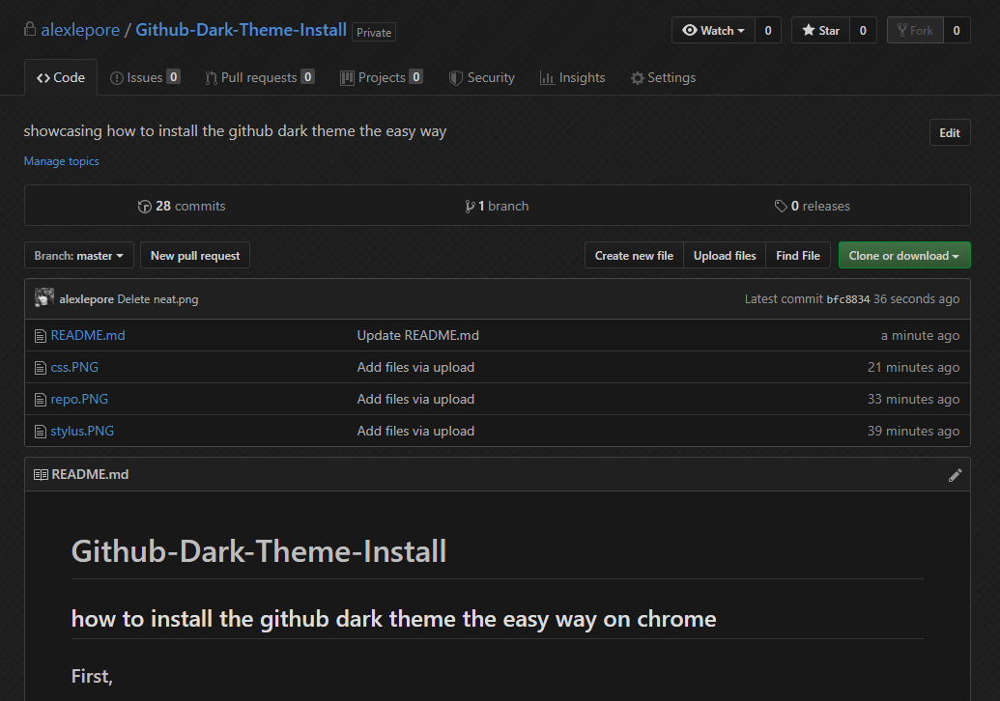
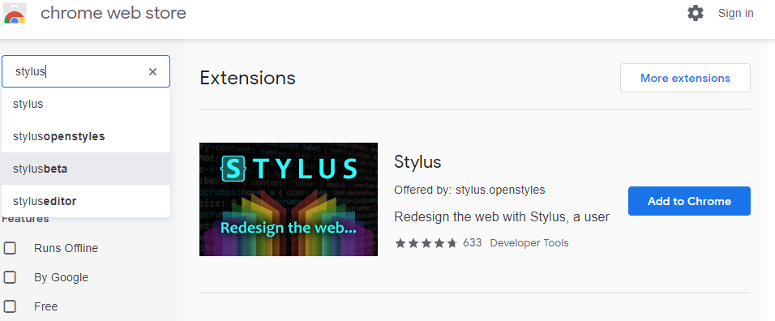
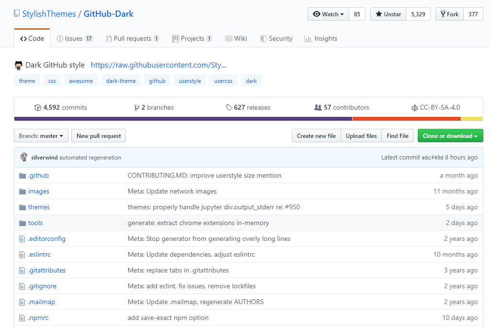
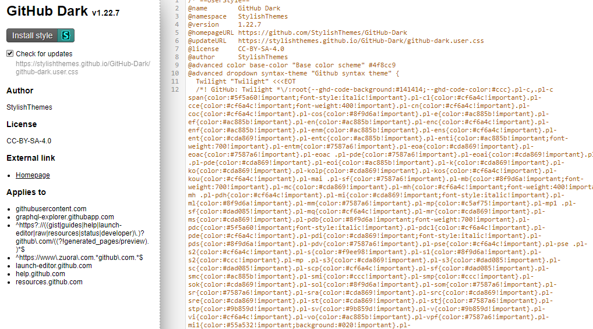

# Github-Dark-Theme-Install

## how to install the github dark theme the easy way on chrome

### First,

Add [Stylus](https://chrome.google.com/webstore/detail/stylus/clngdbkpkpeebahjckkjfobafhncgmne?hl=en-US) to your chrome extensions.

*The stylus manager is what is going to keep the code persistant inside your browser each time you visit Github!!*

### Next,

-Go to the repository.

#### GitHub-Dark theme from [StylishThemes/GitHub-Dark](https://github.com/StylishThemes/GitHub-Dark)

-Scroll down to the first link after it asks to install stylus. 

-Click the [Install the usercss](.) link. 

#### **If you have stylus already installed correctly, clicking this link will direct you to the css needed.**

### Finally,

Click **Install Style**

And Voila, Stylus will refresh all opened tabs in Github and your eyes will thank you later.

